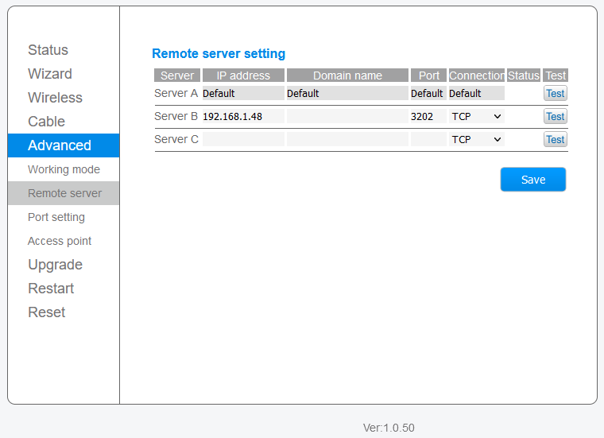

# Trannergy MQTT
MQTT client for Trannergy solar inverter (PVL5400). Written in Python 3.x
This program might also work for Ginlong and Omnik inverters.
The inverter has to be connected to the LAN network where this script is running.

Includes Home Assistant MQTT Auto Discovery.
## Usage:
* Copy `systemd/trannergy-mqtt.service` to `/etc/systemd/system`
* Adapt path in `trannergy-mqtt.service` to your install location (default: `/opt/iot/trannergy`)
* Copy `config.rename.py` to `config.py` and adapt for your configuration (minimal: mqtt ip, username, password)
* `sudo systemctl enable trannergy-mqtt`
* `sudo systemctl start trannergy-mqtt`

The are 2 clients integrated:
### TCP CLIENT
* Works with a specific set of wifi enabled inverters
* You need to have the wifi s/n
* Ability to read values every few seconds

### LISTEN Client
(I could not think of a better name)
* Inverter will broadcast every 5 minutes all parameters
* You have to configure the inverter; in this example, 192.168.1.48 is my Raspberry Pi

Use
http://mqtt-explorer.com/
to test & inspect MQTT messages

## Requirements
* paho-mqtt
* python 3.x

Tested under Linux; there is no reason why it does not work under Windows.

## Licence
GPL v3

## Versions
1.2.5:
* Exit after maxretries to connect to inverter

1.2.4:
* Fix exit code (SUCCESS vs FAILURE)

1.2.2:
* Initial version on github
